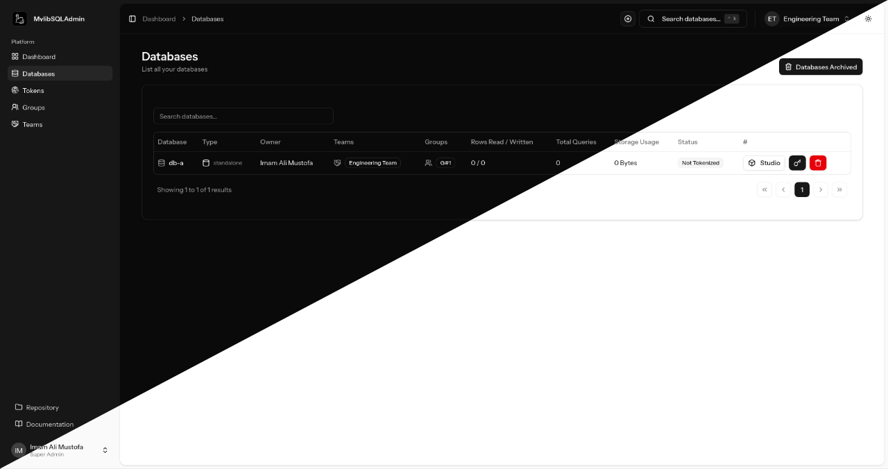

<main>
  

    <picture>
      <source media="(prefers-color-scheme: dark)" srcset="dark-mode.png">
      <source media="(prefers-color-scheme: light)" srcset="light-mode.png">
      
    </picture>
  

  
A Modern SQLite Database Management System

  

    
  

</main>

_MylibSQLAdmin_ is an open-source, modern database management platform designed to simplify working with Modern SQLite (libSQL) databases. Built for developers, DevOps teams, and organizations that rely on SQLite for embedded systems, edge computing, or lightweight applications, _MylibSQLAdmin_ provides a robust GUI and collaboration toolkit to streamline database operations, enhance security, and enable team-based workflows.

- [Ask Me - about this project](https://discordapp.com/users/831132546653880341)
- Support me is not illegal <a href="https://github.com/sponsors/darkterminal">GitHub Sponsor</a> or <a href="https://saweria.co/darkterminal" target="_blank">Saweria</a>

---

## Feature Checklists

Here is the feature checklist based on User access Role and Permissions.

### Super Admin

#### Authentication & Authorization

| Checkbox | Test Case                                                 | Expected Result                           |
| -------- | --------------------------------------------------------- | ----------------------------------------- |
| ✔️      | Login with Super Admin credentials                        | Successful login with correct role claims |
| ✔️      | Verify `hasPermission` returns true for all permissions | All permissions granted                   |
| ✔️      | Access protected routes                                   | Full system access granted                |

#### Database Management

| Checkbox | Test Case                              | Expected Result                         |
| -------- | -------------------------------------- | --------------------------------------- |
| ✔️      | Create database in any team            | Database created successfully           |
| ✔️      | View all databases (including others') | Complete list displayed                 |
| ⏳      | Update any database configuration      | Changes applied universally             |
| ✔️      | Delete any database                    | Immediate deletion without restrictions |
| ✔️      | Access cross-team databases            | Full visibility and control             |
| ✔️      | Access deleted databases               | can view all deleted databases          |
| ✔️      | Restore deleted databases              | can retore some deleted databases       |

#### Team Management

| Checkbox | Test Case                           | Expected Result                  |
| -------- | ----------------------------------- | -------------------------------- |
| ✔️      | Create new team                     | Team created without limitations |
| ✔️      | Delete any existing team            | Team removed immediately         |
| ✔️      | Modify team configurations          | Changes applied to any team      |
| ✔️      | Add/remove members in any team      | Full membership control          |
| ✔️      | Access non-member team resources    | Full access granted              |
| ✔️      | Show pending team member invitation | Apply to any team                |

#### Team Member Invitation

| Checkbox | Test Case                     | Expected Result                         |
| -------- | ----------------------------- | --------------------------------------- |
| ✔️      | Create new invitation         | Invitation appears in team->invitations |
| ✔️      | Access valid invitation URL   | Shows invitation details                |
| ✔️      | Access invalid token          | Returns 404 error                       |
| ✔️      | Access expired invitation     | Shows expiration message                |
| ✔️      | View inviter information      | Displays inviter's name/email           |
| ✔️      | Multiple invitations per team | All appear in team->invitations         |

#### Group Management

| Checkbox | Test Case                           | Expected Result                  |
| -------- | ----------------------------------- | -------------------------------- |
| ✔️      | Create group in any team            | Group created successfully       |
| ✔️      | Delete any group                    | Group removed immediately        |
| ✔️      | Modify group memberships            | Changes applied across teams     |
| ✔️      | Manage group tokens                 | Full token control in all groups |
| ✔️      | Delete database from group          | Database deleted                 |
| ✔️      | Restore deleted database from group | Database restored                |

#### User Management

| Checkbox | Test Case                     | Expected Result                  |
| -------- | ----------------------------- | -------------------------------- |
|       | Create new user with any role | User created successfully        |
|       | Modify existing user roles    | Role changes applied immediately |
|       | Delete any user account       | Account removed permanently      |
|       | View all user activities      | Complete audit logs access       |

#### Role & Permissions

| Checkbox | Test Case                        | Expected Result                      |
| -------- | -------------------------------- | ------------------------------------ |
|       | Create new role                  | Role created with custom permissions |
|       | Modify existing role permissions | Changes propagate immediately        |
|       | Delete non-SuperAdmin roles      | Role removed from system             |
|       | Assign permissions to any role   | Permission hierarchy maintained      |

#### Edge Cases

| Checkbox | Test Case                          | Expected Result             |
| -------- | ---------------------------------- | --------------------------- |
|       | Attempt to delete last Super Admin | Operation prevented         |
|       | Try self-demotion from Super Admin | Operation blocked           |
|       | Bulk operations (100+ items)       | Successful batch processing |
|       | Invalid permission assignments     | Proper validation errors    |
